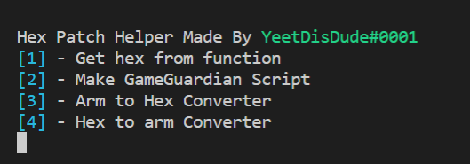

# skid-tool
A quick python script to help you with hex patching

### Requirements to use

  
  - obviously have python installed
  
  - run install.bat to install the modules neede
  

### Extra Notes

  
  - If you are gonna modify the script, do it on custom_script.lua {hextosearch} and {patched hex} MUST stay the same
  
  - Scripts generated will be saved to the folder generated_scripts
  
  - You need internet in order for hex and arm convert to work
  

# CREDIT WHEN USING

